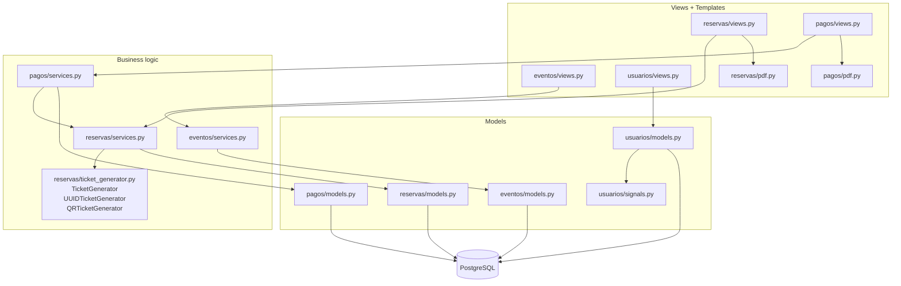
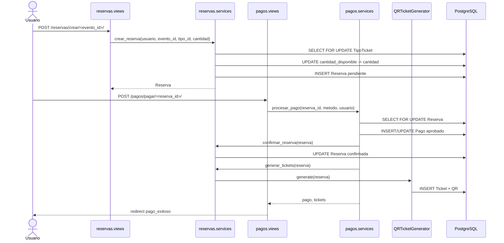
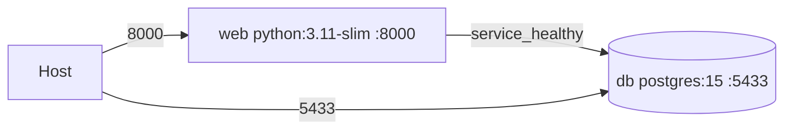

# VibePas - Arquitectura

VibePas es una app Django 4.2 con PostgreSQL. La regla principal del proyecto es
mantener las vistas delgadas: las vistas autentican, cargan objetos y renderizan;
las reglas de negocio viven en `services.py`.

## Capas

## Flujo Reserva + Pago

## Reglas De Codigo

- Operaciones de inventario y pago usan `@transaction.atomic` y `select_for_update()`.
- Los emails de confirmacion/cancelacion se envian con `transaction.on_commit()`.
- `pagos.signals` no existe: los tickets se generan solo desde `pagos.services`.
- Los PDF viven en `apps/*/pdf.py`, no dentro de las vistas.
- `generar_tickets()` devuelve tickets existentes si la reserva ya los tiene.

## Docker

